# Práctica 4 – Viveros  
**Asignatura:** Administración de Bases de Datos (ADBD) 25-26  
**Autor:** Alejandro Rodríguez Rojas  
**Correo:** alu0101317038@ull.edu.es  
**Universidad de La Laguna (ULL)**  

---

## 1. Introducción

El presente trabajo tiene como objetivo el diseño e implementación de una base de datos relacional para la empresa **Tajinaste S.A.**, dedicada a la venta de plantas, productos de jardinería y decoración a través de su red de viveros.  

El sistema debe permitir:
- Controlar el **stock** de productos en las distintas zonas de cada vivero.  
- Gestionar los **empleados** y sus asignaciones a zonas.  
- Llevar el **histórico de productividad** y tareas de los empleados.  
- Administrar los **clientes** y su pertenencia al programa **Tajinaste Plus**.  
- Registrar los **pedidos** gestionados por los empleados y las **bonificaciones mensuales** de los clientes fidelizados.  

El proceso incluye la creación del **modelo Entidad-Relación**, su transformación al **modelo relacional**, la generación de un **script SQL** completo para PostgreSQL y la validación mediante **consultas SELECT** que muestran el resultado final de los datos cargados.

---

## 2. Modelo Entidad-Relación

A continuación se muestra el modelo entidad-relación diseñado a partir del escenario descrito.  
Se ha utilizado **Draw.io** como herramienta de modelado, empleando el modelo E/R extendido.

### Imagen del modelo E/R

A continuación se presenta la imagen del modelo E/R:

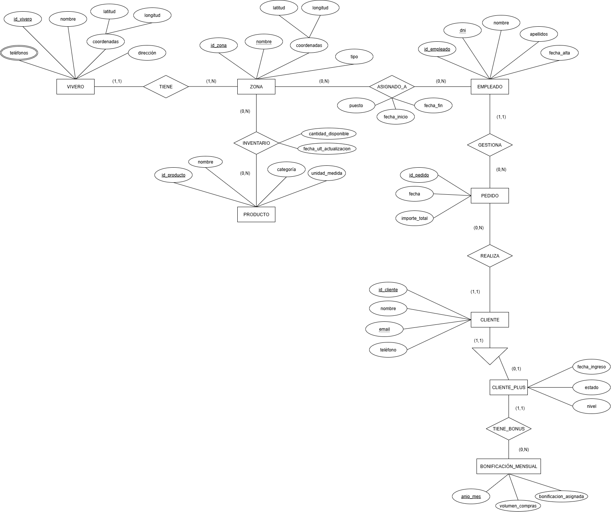

---

## 3. Modelo Relacional

A partir del modelo E/R anterior se ha derivado el **modelo relacional**, representado en el siguiente diagrama.  
Este modelo refleja las tablas, claves primarias, foráneas y relaciones entre ellas.

### Imagen del modelo relacional

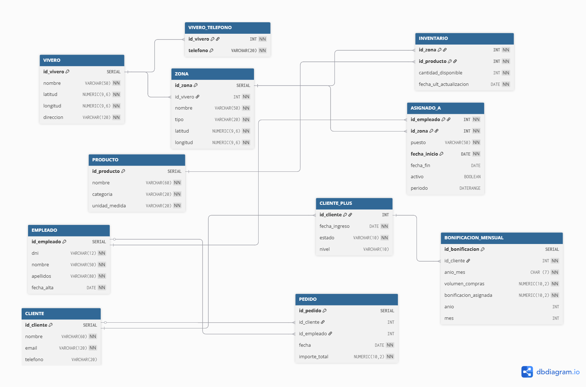

---

## 4. Script SQL

El script SQL define la base de datos **viveros**, crea todas las tablas con sus restricciones, inserta datos de prueba y ejecuta consultas de comprobación.  
Ha sido verificado correctamente en **PostgreSQL** utilizando la consola `psql`.

Archivo del script:  
[viveros.sql](viveros.sql)

### Descripción general del script
- Crea la base de datos `viveros` y conecta automáticamente.  
- Define las tablas principales (`VIVERO`, `ZONA`, `PRODUCTO`, `EMPLEADO`, `CLIENTE`, etc.).  
- Establece claves primarias, foráneas, restricciones `CHECK` y `UNIQUE`.  
- Incluye relaciones N:M mediante las tablas `INVENTARIO` y `ASIGNADO_A`.  
- Contiene inserciones de prueba con cinco registros por tabla.  
- Define restricciones derivadas (`activo`, `anio`, `mes`).  
- Añade ejemplos de `DELETE` y consultas `SELECT` para validación.  

### Ejecución del script

Para ejecutar el script **viveros.sql** y crear toda la base de datos desde la terminal, sigue los pasos siguientes:

1. Abre una terminal en el directorio donde se encuentra tu archivo `viveros.sql`.  

2. Accede al intérprete de PostgreSQL con el usuario `postgres` o el que tengas configurado:
   ```bash
   sudo -i -u postgres
   psql
    ```
3. Ejecuta el script SQL utilizando el siguiente comando:
    ```sql
    \i /ruta/completa/al/archivo/viveros.sql
    ```

---

## 5. Salidas de los SELECT

A continuación se muestran las salidas de las consultas `SELECT` incluidas en el script, que permiten comprobar el correcto funcionamiento de la base de datos y la consistencia de los datos.

### Resultados de las tablas principales

1. **Tabla VIVERO**  
   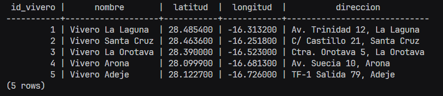 

2. **Tabla VIVERO_TELEFONO**  
   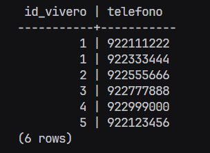

3. **Tabla ZONA**  
    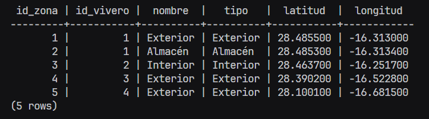

4. **Tabla PRODUCTO**  
   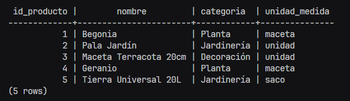

5. **Tabla EMPLEADO**  
   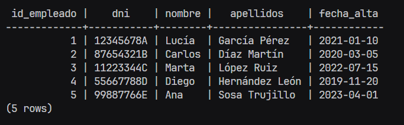

6. **Tabla CLIENTE**  
   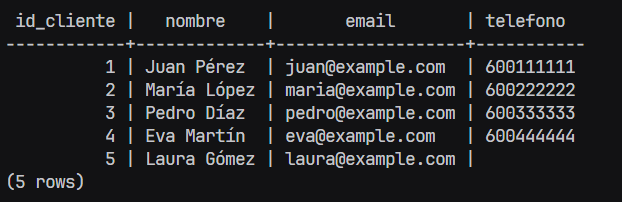

7. **Tabla CLIENTE_PLUS**  
    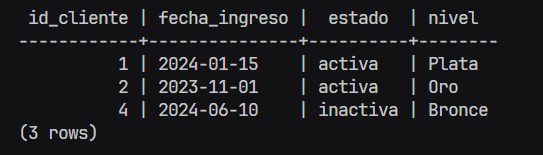

8. **Tabla BONIFICACION_MENSUAL**  
   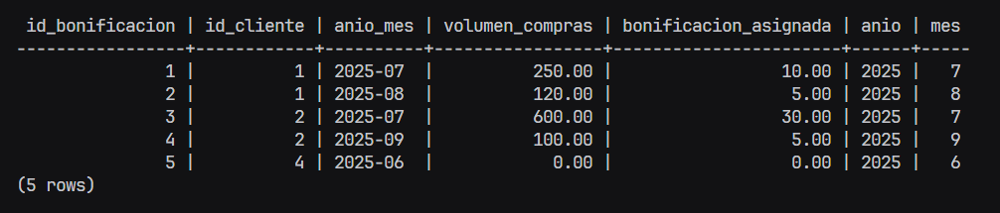  

9. **Tabla PEDIDO**  
    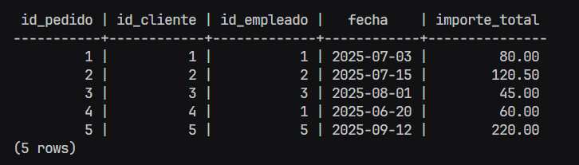

10. **Tabla INVENTARIO**  
    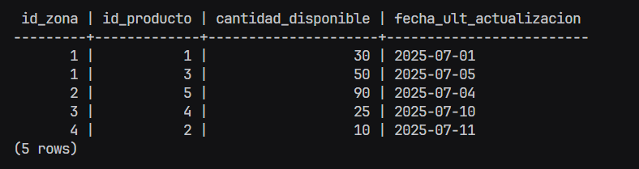 

11. **Tabla ASIGNADO_A**  
    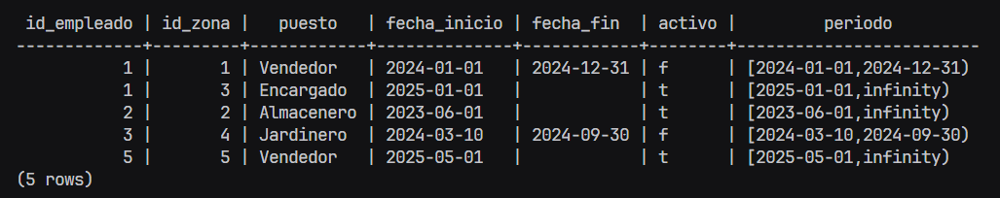  

---

